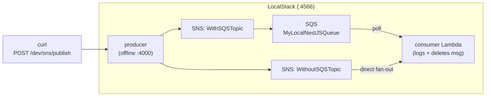

# RUNBOOK — Running the SNS/SQS Demo Locally

End-to-end guide for running the **producer** (`serverless-nestjs-api-sns`) and
**consumer** (`serverless-nestjs-sqs-consumer`) against **LocalStack**, and
driving them with the simulate scripts in `ite-spa-06/`.

This is the demo behind **ITE-SPA-06: Integration and Deployment** — it shows the
two integration patterns from `ite-spa-06/arc-diagrams.md`:

| Path | Flow | Topic |
|---|---|---|
| **With SQS** (buffered, durable) | API → SNS → **SQS** → consumer Lambda | `WithSQSTopic` |
| **Without SQS** (direct fan-out) | API → SNS → consumer Lambda | `WithoutSQSTopic` |



---

## 1. Prerequisites

| Tool | Why | Check |
|---|---|---|
| Docker | runs LocalStack via the pinned image in `docker-compose.yml` | `docker -v` |
| Node.js 20+ | runs the NestJS apps | `node -v` |
| AWS CLI v2 | creates/inspects LocalStack resources | `aws --version` |
| `jq` | builds the queue policy in `bootstrap.sh`; nicer queue output | `jq --version` |

No separate LocalStack install is needed — `docker compose up -d` (step 2a) pulls
the pinned `localstack/localstack:3.8.1` community image, which runs SNS/SQS/Lambda
with no account or token.

> ℹ️ Both apps run on **Serverless Framework v3** — no login or access key required.

---

## 2. One-time setup

### 2a. Start LocalStack

This repo ships a `docker-compose.yml` pinned to the **3.8.1 community image**,
which runs SNS/SQS/Lambda with **no account or auth token** (the 2026.x CLI and
images now require a LocalStack account — see the note below).

```bash
docker compose up -d      # start (uses docker-compose.yml at the repo root)
docker compose down       # stop + remove when finished
```

Verify: `curl -s http://localhost:4566/_localstack/health | jq '.services'` should
show `sns`, `sqs`, and `lambda` as `available`.

> **Why not `localstack start`?** The Homebrew/`pip` CLI pulls the latest image,
> which hard-requires a (free) account login. Pinning the `3.8.1` image via Compose
> avoids that entirely. If you prefer the CLI, create a free account at
> app.localstack.cloud, run `localstack auth set-token <token>`, then `localstack start`.

### 2b. Install dependencies (neither app ships `node_modules`)

```bash
cd serverless-nestjs-api-sns      && npm install && cd ..
cd serverless-nestjs-sqs-consumer && npm install && cd ..
```

### 2c. Create the AWS resources + `.env.local` files

```bash
./bootstrap.sh
```

This is **idempotent** and creates, inside LocalStack:

- SQS queue `MyLocalNestJSQueue`
- SNS topics `WithSQSTopic`, `WithoutSQSTopic`, `MyLocalNestJSSNSTopic`
- the `WithSQSTopic → MyLocalNestJSQueue` subscription
- `.env.local` in each app (dummy `test`/`test` creds, LocalStack endpoint, ARNs) — existing files are left untouched

The `WithoutSQSTopic → Lambda` subscription is created later, automatically, when you deploy the consumer (step 3b).

---

## 3. Run it

You need **two or three terminals**. Terminal A keeps LocalStack running (step 2a).

### 3a. Start the producer (HTTP API on :4000)

```bash
cd serverless-nestjs-api-sns
npx serverless offline start
```

Smoke-test the endpoint (from another terminal):

```bash
curl -X POST -H "Content-Type: application/json" \
  -d '{"message":"hello","subject":"smoke","topicArn":"arn:aws:sns:ap-southeast-1:000000000000:WithSQSTopic"}' \
  http://localhost:4000/dev/sns/publish
# => {"success":true,"messageId":"..."}
```

### 3b. Deploy the consumer to LocalStack

The consumer reacts to **event-source triggers** (SQS poll + SNS subscription).
`serverless offline` alone does **not** emulate those triggers, so the consumer
must be **deployed into LocalStack**, where LocalStack invokes the Lambda:

```bash
cd serverless-nestjs-sqs-consumer
npm run build                    # produces dist/main.handler
npx serverless deploy            # serverless-localstack targets :4566
```

This registers the Lambda, the SQS event-source mapping, and the
`WithoutSQSTopic → Lambda` subscription.

---

## 4. Drive traffic & observe

### With-SQS path (API → SNS → SQS → Lambda)

```bash
./ite-spa-06/simulate-sns-with-sqs.sh      # 10 messages to WithSQSTopic
```

Watch the consumer logs:

```bash
aws --endpoint-url http://localhost:4566 logs tail \
  /aws/lambda/serverless-nestjs-sqs-consumer-dev-consumeSqsMessages --follow
```

You should see `Received message: Hello from job N` then `... deleted from queue.`

### Without-SQS path (API → SNS → Lambda directly)

```bash
./ite-spa-06/simulate-sns-without-sqs.sh   # 10 messages to WithoutSQSTopic
```

Same log tail — the consumer logs `Processing SNS message: ...` for these
(handled by the `record.Sns` branch in `src/main.ts`).

---

## 5. Lightweight verification (no Lambda)

If you only want to **prove the SNS→SQS integration** without deploying the
consumer Lambda (faster, avoids the LocalStack-Lambda setup), publish
and then read straight off the queue:

```bash
./ite-spa-06/simulate-sns-with-sqs.sh

aws --endpoint-url http://localhost:4566 --region ap-southeast-1 \
  sqs receive-message \
  --queue-url http://localhost:4566/000000000000/MyLocalNestJSQueue \
  --max-number-of-messages 10 \
  --query 'Messages[].Body' --output text | jq .
```

Each body is the SNS envelope JSON; the original payload is in the `.Message` field.

---

## 6. Teardown

```bash
docker compose down      # stops and removes the container (resources are ephemeral)
```

To recreate resources without restarting LocalStack, just re-run `./bootstrap.sh`.

---

## Troubleshooting

| Symptom | Fix |
|---|---|
| `InvalidParameterException: Invalid parameter: TopicArn` | Topic not created — run `./bootstrap.sh`; confirm the ARN region is `ap-southeast-1`. |
| `InvalidClientTokenId: security token is invalid` | Missing dummy creds — ensure `.env.local` exists (re-run `./bootstrap.sh`). |
| Consumer never fires | `serverless offline` does **not** trigger SQS/SNS — you must `serverless deploy` (step 3b). |
| `License activation failed` / `LocalStack requires an account to run` | 2026.x account gate. Use the pinned community image instead: `docker compose up -d` (step 2a). No token needed for SNS/SQS/Lambda. |
| Region mismatch warnings | Producer code defaults to `ap-southeast-3` but the ARNs/scripts use `ap-southeast-1`; `.env.local` pins `ap-southeast-1`. Keep everything on `ap-southeast-1`. |

See also `serverless-nestjs-api-sns/troubleshooting.md` for the original producer-only notes.
