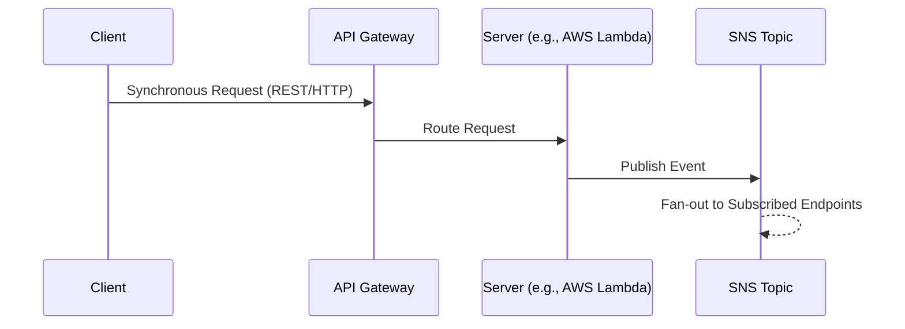
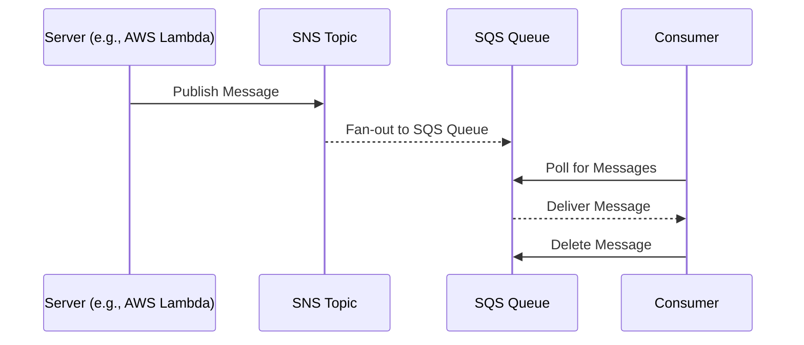

# Architecture Diagrams

## 1. Client -> Server via API Gateway -> SNS

```mermaid
sequenceDiagram
    participant Client
    participant APIGateway as API Gateway
    participant Server as Server (e.g., AWS Lambda)
    participant SNS as SNS Topic

    Client->>APIGateway: Synchronous Request (REST/HTTP)
    APIGateway->>Server: Route Request
    Server->>SNS: Publish Event
    SNS-->>SNS: Fan-out to Subscribed Endpoints
```

## 2. Client -> Server via API Gateway -> SNS & SQS

```mermaid
sequenceDiagram
    participant Server as Server (e.g., AWS Lambda)
    participant SNS as SNS Topic
    participant SQS as SQS Queue
    participant Consumer

    Server->>SNS: Publish Message
    SNS-->>SQS: Fan-out to SQS Queue
    Consumer->>SQS: Poll for Messages
    SQS-->>Consumer: Deliver Message
    Consumer->>SQS: Delete Message
```
