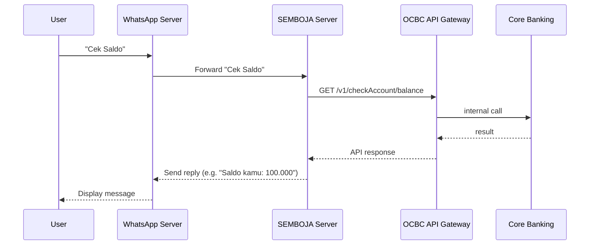

# OCHA Diagram

```mermaid
sequenceDiagram
    participant User
    participant WhatsAppServer as WhatsApp Server
    participant SembojaServer as SEMBOJA Server
    participant APIGateway as OCBC API Gateway
    participant CoreBanking as Core Banking

    User->>WhatsAppServer: "Cek Saldo"
    WhatsAppServer->>SembojaServer: Forward "Cek Saldo"
    SembojaServer->>APIGateway: GET /v1/checkAccount/balance
    APIGateway->>CoreBanking: internal call
    CoreBanking-->>APIGateway: result
    APIGateway-->>SembojaServer: API response
    SembojaServer-->>WhatsAppServer: Send reply (e.g. "Saldo kamu: 100.000")
    WhatsAppServer-->>User: Display message
```